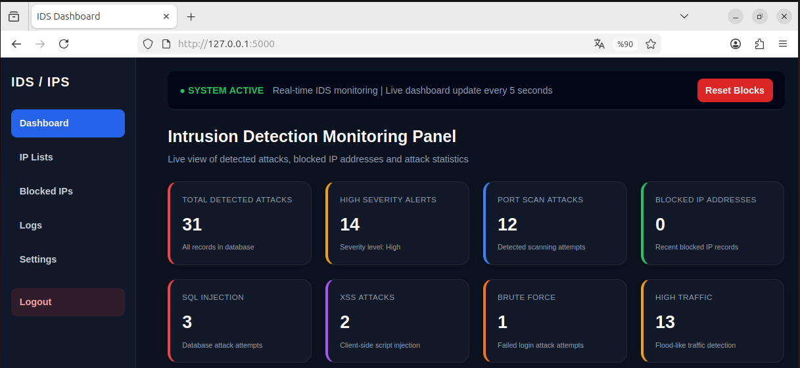
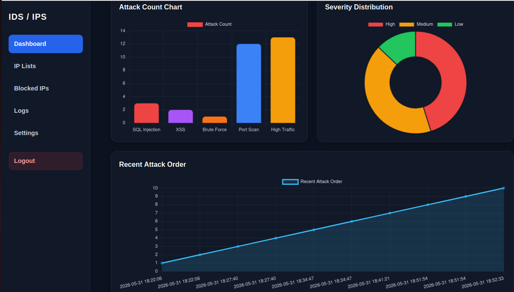
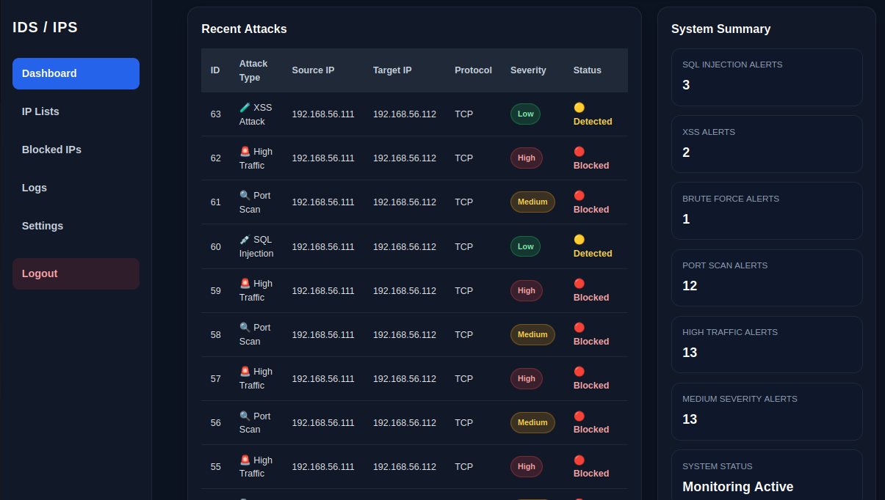
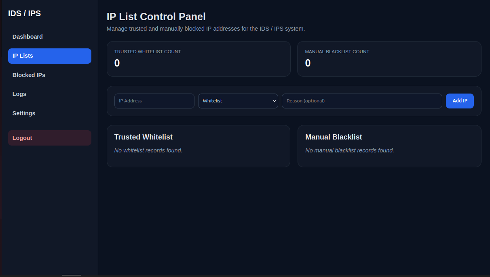
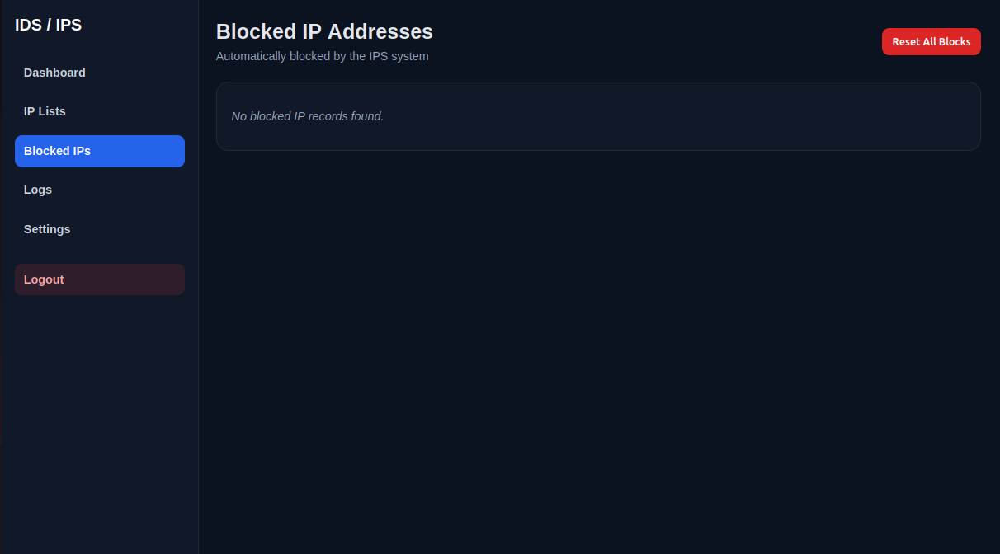
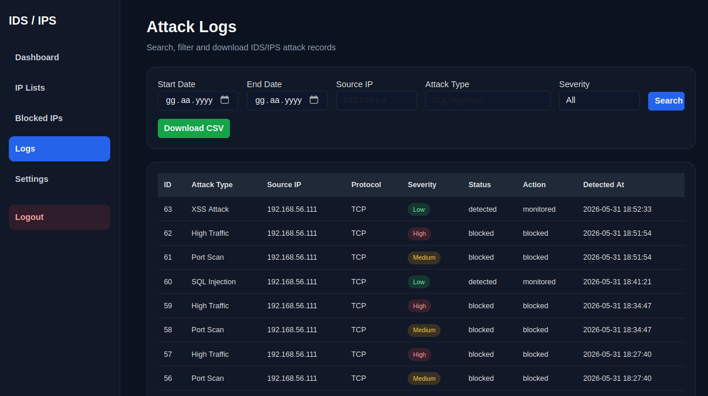
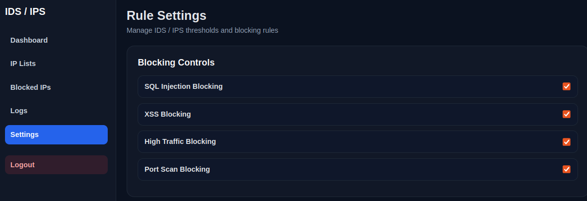
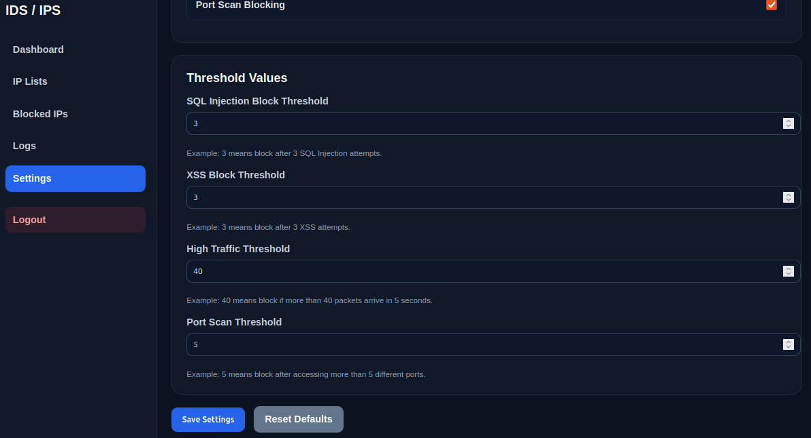

<h1 align="center">🛡️ CyberPulse</h1>

<p align="center">
<b>Real-Time Intrusion Detection & Prevention System (IDS/IPS)</b>
</p>

<p align="center">
  
  
  
  
  
  
</p>

<p align="center">
Lightweight Real-Time Intrusion Detection and Prevention System for Small-Scale Networks
</p>

---

# 📌 About The Project

CyberPulse is a lightweight **Real-Time Intrusion Detection and Prevention System (IDS/IPS)** developed as a Software Engineering Graduation Project.

The system monitors network traffic in real time, detects malicious activities, stores attack records in a PostgreSQL database, and automatically blocks malicious IP addresses using firewall rules.

CyberPulse provides an interactive web dashboard for monitoring attacks, managing IP addresses, configuring security rules, and analyzing attack statistics.

---

# 🎓 Academic Project

This project demonstrates practical implementations of:

- Network Monitoring
- Intrusion Detection
- Automated Prevention Mechanisms
- Attack Logging and Reporting
- Database Integration
- Web-Based Security Dashboard Development

---

# ✨ Features

✅ Real-time network traffic monitoring  
✅ SQL Injection detection  
✅ Cross-Site Scripting (XSS) detection  
✅ Port Scan detection  
✅ High Traffic anomaly detection  
✅ Brute Force login detection  
✅ Automatic IP blocking using iptables  
✅ Whitelist and Blacklist management  
✅ Interactive Web Dashboard  
✅ Attack log filtering and CSV export  
✅ Configurable detection thresholds

---

# 🏗️ System Architecture

CyberPulse was tested in a virtual laboratory environment consisting of multiple virtual machines.

```text
┌──────────────────┐
│   Attacker VM    │
└────────┬─────────┘
         │ Attack Traffic
         ▼
┌──────────────────┐
│    CyberPulse    │
│      IDS/IPS     │
└────────┬─────────┘
         │
         ├────────► PostgreSQL Database
         │
         └────────► Flask Dashboard
```

The IDS/IPS monitors network traffic, records detected attacks into PostgreSQL, and provides real-time statistics through the web dashboard.

---

# ⚙️ Installation

### 1️⃣ Clone Repository

```bash
git clone https://github.com/sudenurgungor/CyberPulse.git
cd CyberPulse
```

### 2️⃣ Create Virtual Environment

```bash
python3 -m venv venv
source venv/bin/activate
```

### 3️⃣ Install Dependencies

```bash
pip install -r requirements.txt
```

### 4️⃣ Configure Database

Edit:

```text
source/config.py
```

Example:

```python
DB_HOST = "localhost"
DB_NAME = "intrusiondb"
DB_USER = "postgres"
DB_PASSWORD = "your_password"
```

---

# ▶️ Running The Project

### Start Flask Dashboard

```bash
sudo venv/bin/python source/app.py
```

### Start Packet Sniffer

```bash
sudo venv/bin/python source/main.py
```

Dashboard:

```text
http://127.0.0.1:5000
```

---

# 🚨 Supported Attack Types

| Attack Type | Description |
|-------------|-------------|
| SQL Injection | Detects malicious SQL payloads and suspicious query patterns |
| XSS Attack | Detects client-side script injection attempts |
| Port Scan | Detects scanning attempts on multiple ports |
| High Traffic | Detects abnormal traffic spikes |
| Brute Force | Detects repeated failed login attempts |

---

# 🖥️ Dashboard Screenshots

## 🔐 Login Page



---

## 📊 Dashboard Overview



---

## 🚨 Recent Attacks & System Summary



---

## 🌐 IP List Management



---

## 🚫 Blocked IP Addresses



---

## 📝 Attack Logs & CSV Export



---

## ⚙️ Rule Settings - Blocking Controls



---

## ⚙️ Rule Settings - Threshold Configuration



---

# 🗄️ Database

CyberPulse uses PostgreSQL to store:

- Attacks
- Blocked IP Addresses
- Whitelist Records
- Blacklist Records

Main database tables:

```text
attacks
blocked_ips
ip_lists
```

Database schema:

```text
database/schema.sql
```

---

# 📊 Dashboard Modules

- 📈 Live attack statistics
- 📝 Recent attack records
- 🌐 IP whitelist and blacklist management
- 🚫 Blocked IP management
- 📋 Attack log filtering
- ⚙️ Rule settings and thresholds
- 📥 CSV export

---

# 🔧 Default Thresholds

| Rule | Value |
|------|--------|
| SQL Injection Block Threshold | 3 attempts |
| XSS Block Threshold | 3 attempts |
| High Traffic Threshold | 40 packets / 5 seconds |
| Port Scan Threshold | 5 different ports |

---

# 📁 Project Structure

```text
CyberPulse
│
├── database
│   ├── README.txt
│   └── schema.sql
│
├── docs
│   └── images
│
├── source
│   ├── app.py
│   ├── config.py
│   ├── db.py
│   ├── main.py
│   ├── sniffer.py
│   └── templates
│
├── requirements.txt
├── rules_config.json
├── README.md
└── .gitignore
```

---

# 🛠 Skills Demonstrated

- Python Programming
- Network Security
- Packet Analysis
- Database Management
- Web Development
- Linux Administration
- Firewall Management
- Intrusion Detection
- Secure System Design

---

# 🚀 Future Improvements

- 🤖 Machine Learning-based anomaly detection
- 📧 Email notification system
- ⏱️ Automatic unblock timer
- 👥 Role-based authentication
- 🐳 Docker deployment
- ☁️ Centralized log collection
- 🌍 Deployment on real network environments
- 📊 SIEM integration
- 🔔 Real-time alert notifications
- 📱 Responsive dashboard improvements

---

# 👩‍💻 Author

**Sude Güngör**

🎓 Software Engineering Graduate  
💻 Aspiring Software Developer  
🔐 Interested in Cybersecurity and Network Security

🌐 GitHub: https://github.com/sudenurgungor

---

# 📄 License

This project is intended for educational and research purposes.

---

⭐ If you like this project, don't forget to give it a star!
